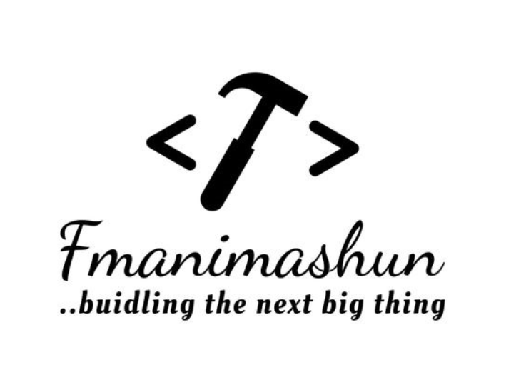

<div align="center">
   
  <br/>
</div>

# 📗 Table of Contents

- [📖 About the Project](#about-the-project)
- [🚀 Live Demo](#live-demo)
- [💻 Getting Started](#getting-started)
  - [Setup](#setup)
  - [Install](#install)
  - [Usage](#usage)
- [👥 Author](#author)
- [🤝 Contributing](#contributing)
- [⭐️ Show your support](#show-your-support)
- [🙏 Acknowledgments](#acknowledgments)
- [📝 License](#license)

## 📖 About the Project

The **Button Component Challenge** is designed to challenge developers in creating a flexible and reusable button component. Here are the main requirements:

### User Stories

- [ ] I can see different button types: default, outline, and text.
- [ ] I can choose to disable box-shadow.
- [ ] I can choose to disable the button.
- [ ] I can choose to have an icon on the left or right (Use Google Icon and at least 5 variants).
- [ ] I can have different button sizes.
- [ ] I can have different colors.
- [ ] When I hover or focus, I can see visual indicators.
- [ ] I can still access all button attributes.
- [ ] (Optional) Show button in a similar way like the design or use Storybook.

## 🚀 Live Demo

- [Live Demo Link](https://fmanimashaun.github.io/button-component/)

## 💻 Getting Started

### Setup

```bash
cd your-desired-folder
git clone https://github.com/fmanimashaun/button-component.git
cd button-component
```

### Install

```bash
npm install
```

### Usage

```bash
npm run start
```

## 👥 Authors <a name="authors"></a>

👤 **Engr. Animashaun Fisayo**

- [GitHub](https://github.com/fmanimashaun)
- [Twitter](https://twitter.com/fmanimashaun)
- [LinkedIn](https://www.linkedin.com/in/fmanimashaun/)
- [Website](https://fmanimashaun.com)

<p align="right">(<a href="#readme-top">back to top</a>)</p>

## 🤝 Contributing

Contributions, issues, and feature requests are welcome!

Feel free to check the [issues page](../../issues/)

<p align="right">(<a href="#readme-top">back to top</a>)</p>

## ⭐️ Show your support <a name="support"></a>

If you like this project and want to support me, you can give a ⭐️ to this repo!

<p align="right">(<a href="#readme-top">back to top</a>)</p>


## 🙏 Acknowledgments <a name="acknowledgements"></a>

- [devchallenges.io](https://devchallenges.io/)

<p align="right">(<a href="#readme-top">back to top</a>)</p>

## 📝 License <a name="license"></a>

This project is [MIT](./MIT.md) licensed.


